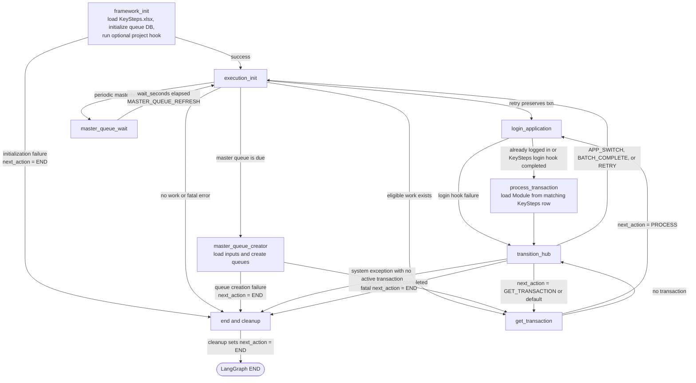
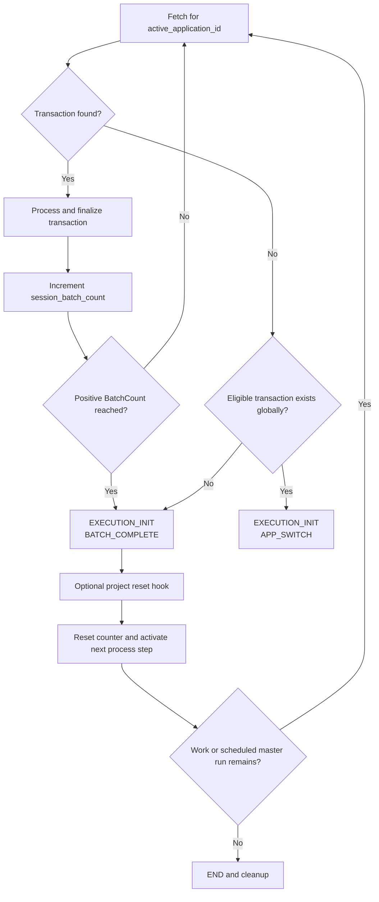
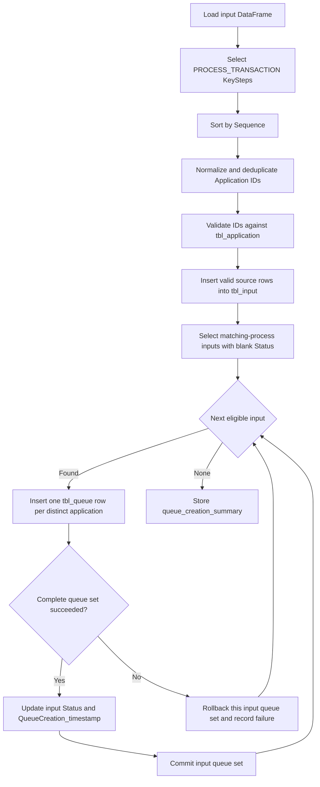

# Orqflow Graph Flowchart

## Application Batch Scheduling

- `BatchCount` blank or zero means process all eligible work for that application in one session.
- A positive `BatchCount` closes/resets the application session after that many finalized transactions.
- Success, skipped business exceptions, and retry-exhausted failures count as finalized; retry attempts do not.
- With one process application, the same application is reactivated after each positive batch.
- With multiple process applications, scheduling cycles in numeric KeySteps `Sequence` order until the global eligible queue is empty.

## Master Queue Creation

- `Case_Details` stores the eligible `tbl_input.ID` and `Application_Details` stores the normalized KeyStep application ID.
- Both `tbl_queue.Processing_Status` and the completed `tbl_input.Status` use `queue_config.eligible_status`, defaulting to `Queue Created`.
- The input status and timestamp are updated only after its complete distinct-application queue set succeeds.
- A failed input is rolled back independently and remains eligible for a later retry; later inputs continue processing.
- Queue creation assumes one master creator per process. Successfully updated input status prevents duplicates on normal reruns.

## Framework Initialization Notes

- `framework_init` now loads `KeySteps.xlsx` from the active project config directory before the first execution cycle starts.
- The shared Excel reader is loaded from `<share_root>/common/excel.py` using the config context resolved during startup.
- Loaded key-step data is stored on `state["key_steps"]` for later runtime nodes.
- At most one `FRAMEWORK_INIT` row is allowed. Its optional `Module` uses `package.module:function` and runs after the process scheduler and queue database are initialized.
- Framework-hook start, completion, skip, and module-selection details are recorded through the standard safe logging boundary.
- If loading fails, framework initialization records `Outcome.SYSTEM_EXCEPTION`, stores the error in `runtime_config.last_error`, and sets `runtime_config.next_action` to `END`.
- The graph honors that `END` action immediately; failed framework initialization does not continue to `execution_init`.

## Process Transaction Notes

- The active transaction provides `queue_application_details`, which identifies its application.
- The framework selects the matching `PROCESS_TRANSACTION` row from `KeySteps.xlsx` and orders matching rows by numeric `Sequence`.
- The `Module` cell uses `package.module:function` format, for example `image_value_extraction.runtime:run_process`.
- The configured callable receives the complete shared state and returns a framework result containing `outcome`, optional `message`, optional `data`, and optional `next_action`.
- Unexpected import, configuration, execution, or result-validation failures become `Outcome.SYSTEM_EXCEPTION`.
- After retry exhaustion, a system exception without an active transaction routes to `END` instead of returning repeatedly to `GET_TRANSACTION`.

## Login Application Notes

- When no application session is active, the framework selects the matching `LOGIN_APPLICATION` row from `KeySteps.xlsx` using the active transaction's `queue_application_details` value.
- Matching rows are ordered by numeric `Sequence`; the first row's `Module` is loaded using `package.module:function` and called with the complete shared state.
- A missing matching row keeps the existing placeholder login behavior. A matching row with a blank or invalid module is a configuration failure.
- Login skip/start/completion events are logged at `INFO`; application and module selection are logged at `DEBUG`; failures include an `ERROR` traceback without logging transaction payloads.
- Login loading or execution failures become `Outcome.SYSTEM_EXCEPTION` and route through `transition_hub`, allowing the normal retry policy to apply.
