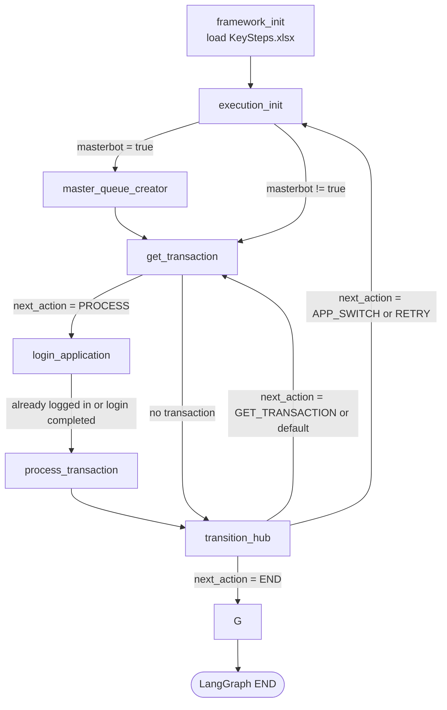

# Orqflow Graph Flowchart

## Framework Initialization Notes

- `framework_init` now loads `KeySteps.xlsx` from the active project config directory before the first execution cycle starts.
- The shared Excel reader is loaded from `<share_root>/common/excel.py` using the config context resolved during startup.
- Loaded key-step data is stored on `state["key_steps"]` for later runtime nodes.
- If loading fails, framework initialization records `Outcome.SYSTEM_EXCEPTION`, stores the error in `runtime_config.last_error`, and sets `runtime_config.next_action` to `END`.
