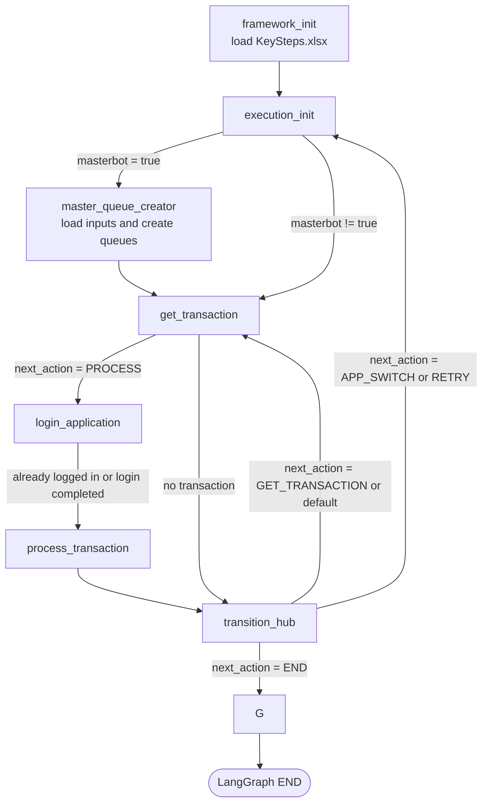
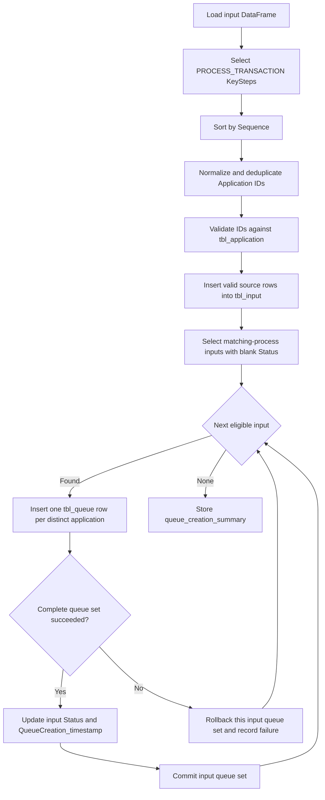

# Orqflow Graph Flowchart

## Master Queue Creation

- `Case_Details` stores the eligible `tbl_input.ID` and `Application_Details` stores the normalized KeyStep application ID.
- Both `tbl_queue.Processing_Status` and the completed `tbl_input.Status` use `queue_config.eligible_status`, defaulting to `Queue Created`.
- The input status and timestamp are updated only after its complete distinct-application queue set succeeds.
- A failed input is rolled back independently and remains eligible for a later retry; later inputs continue processing.
- Queue creation assumes one master creator per process. Successfully updated input status prevents duplicates on normal reruns.

## Framework Initialization Notes

- `framework_init` now loads `KeySteps.xlsx` from the active project config directory before the first execution cycle starts.
- The shared Excel reader is loaded from `<share_root>/common/excel.py` using the config context resolved during startup.
- Loaded key-step data is stored on `state["key_steps"]` for later runtime nodes.
- If loading fails, framework initialization records `Outcome.SYSTEM_EXCEPTION`, stores the error in `runtime_config.last_error`, and sets `runtime_config.next_action` to `END`.
