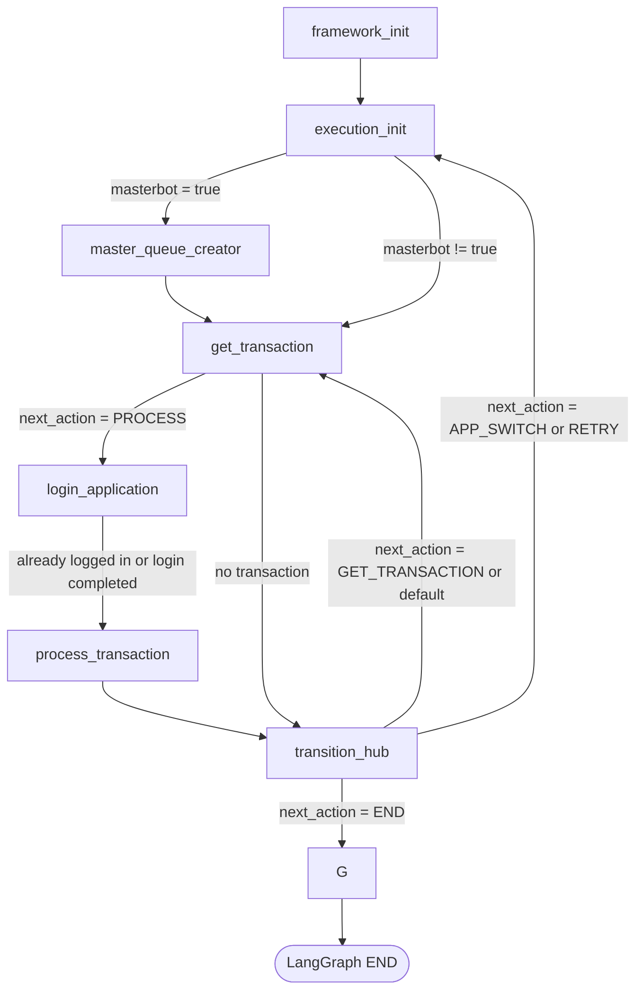

# Orqflow Graph Flowchart

```mermaid
flowchart TD
    A[framework_init] --> B[execution_init]

    B -->|masterbot = true| C[master_queue_creator]
    B -->|masterbot != true| D[get_transaction]

    C --> D

    D -->|next_action = PROCESS| E[login_application]
    D -->|no transaction| F[transition_hub]

    E -->|already logged in or login completed| I[process_transaction]
    I --> F[transition_hub]

    F -->|next_action = APP_SWITCH or RETRY| B
    F -->|next_action = GET_TRANSACTION or default| D
    F -->|next_action = END| G

    G --> H([LangGraph END])
```
